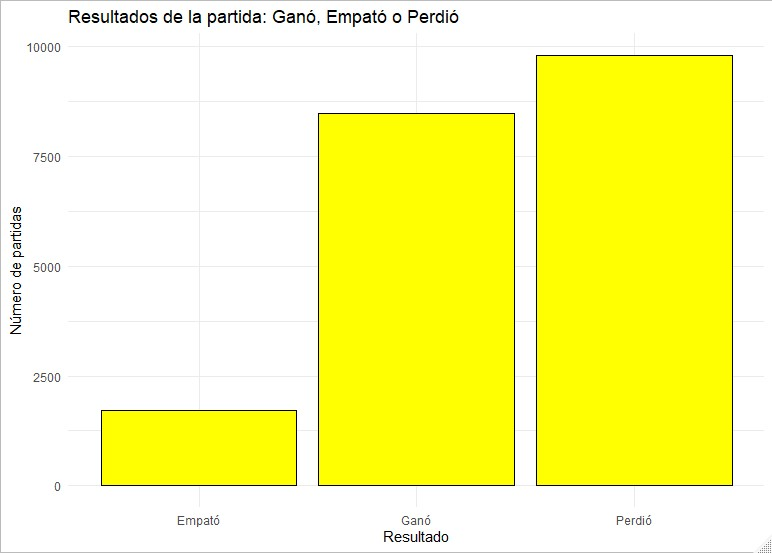
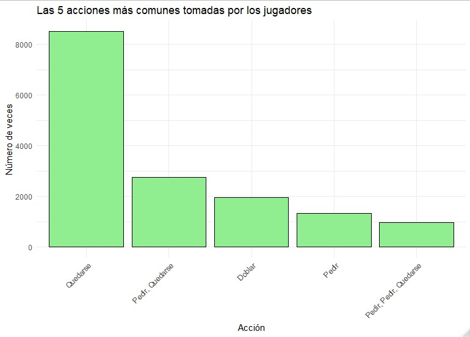
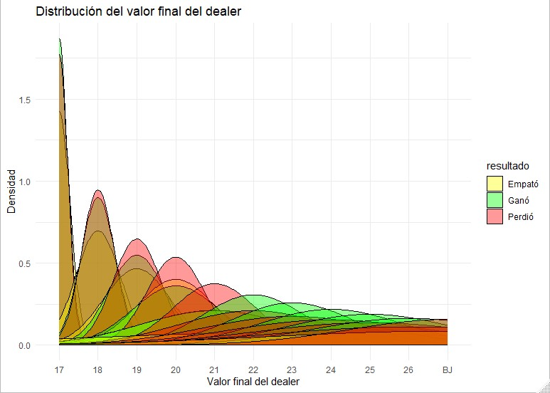

# Análisis Estratégico del Blackjack 🃏

## Descripción del Proyecto  

Este proyecto utiliza el modelo **KDD (Knowledge Discovery in Databases)** para analizar datos históricos de partidas de Blackjack. El objetivo es identificar patrones estratégicos en el comportamiento de los jugadores y las cartas repartidas, ayudando a desarrollar estrategias que maximicen las posibilidades de ganar de manera informada y ética.

## Objetivos  
- Identificar patrones en las decisiones de los jugadores de Blackjack, utilizando técnicas de análisis de datos, para optimizar las estrategias y maximizar las probabilidades de éxito en el juego.
- Analizar las decisiones de los jugadores (pedir, quedarse, doblar, dividir) en relación con las cartas visibles del dealer.
- Identificar qué combinaciones de cartas y decisiones estratégicas tienden a generar mejores resultados para los jugadores.  
- Explorar patrones en los datos que podrían ser explotados para mejorar la estrategia del jugador en futuras partidas.

## Metodología  
El proyecto sigue las fases del modelo **KDD**:  
1. **Dominio del problema**: Estudio de las reglas del Blackjack y contexto de juego en casinos.  
2. **Selección de datos**: Uso de datasets específicos de partidas históricas de Blackjack disponibles en Kaggle.  
3. **Limpieza y transformación**: Procesamiento de los datos para eliminar inconsistencias y preparar el dataset para el análisis.  
4. **Minería de datos**: Identificación de patrones relevantes en el comportamiento de jugadores y distribución de cartas, en este caso se utilizaron las redes neuronales para crear un modelo que pudiera aprender patrones en los datos y realizar predicciones.  
5. **Evaluación e interpretación**: Generación de resultados y conclusiones.

## Requisitos  
- **Lenguaje de programación**: R (versión 4.0 o superior recomendada).  
- **Paquetes**:  
  - tidyverse  
  - ggplot2  
  - dplyr  
  - knitr  
  - rmarkdown  
- **Datasets**:  
  - [900.000 Hands of BlackJack Results](https://www.kaggle.com/datasets/mojocolors/900000-hands-of-blackjack-results).
  - [50 Million Blackjack Hands](https://www.kaggle.com/datasets/dennisho/blackjack-hands).

## Resultados

- **Gráficos y visualizaciones.**  
  A continuación se muestran algunas de las gráficas que ilustran las tendencias y patrones descubiertos durante el análisis del juego de Blackjack.
  
  
  
  *Figura 1: Resultados de las diferentes partidas de BlackJack.*

  
  
  *Figura 2: Acciones comunes tomadas por los jugadores.*

  
  
  *Figura 3: Distribución del valor final de dealer con respecto al resultado.*

- **Conclusiones estratégicas basadas en los datos analizados.**  
  Basado en los análisis anteriores, se han derivado las siguientes conclusiones estratégicas:  
  - Los jugadores deben evitar apostar en manos de bajo valor y centrarse en maximizar sus apuestas en manos fuertes.  
  - El conteo de cartas es una estrategia viable para optimizar las decisiones.

- **Recomendaciones para optimizar las decisiones en el juego.**  
  Se recomienda a los jugadores ajustar sus estrategias según las cartas del crupier, particularmente en los escenarios mostrados en las demás gráficas del proyecto.
